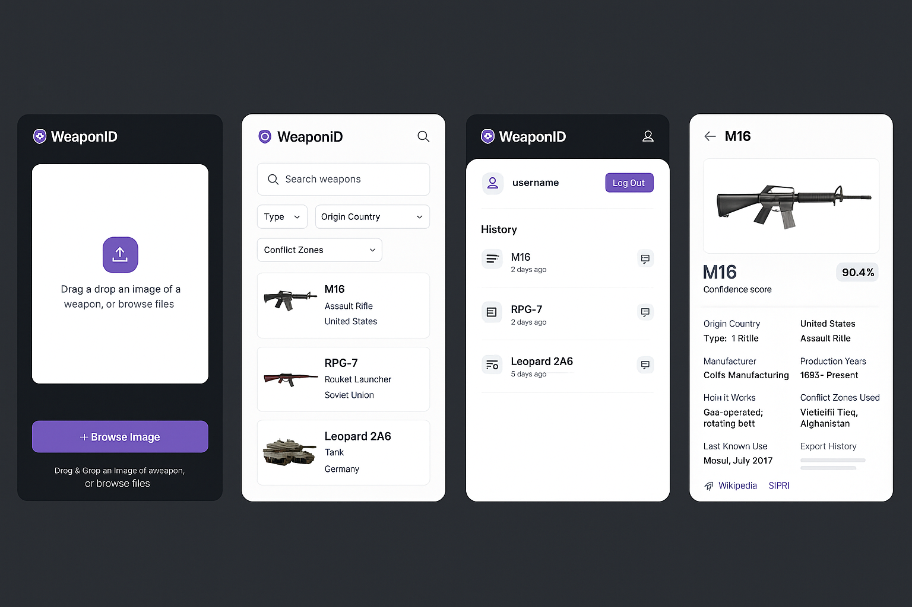
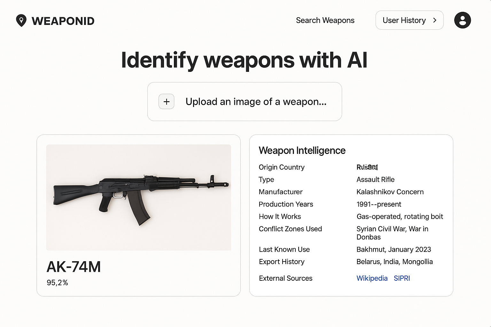
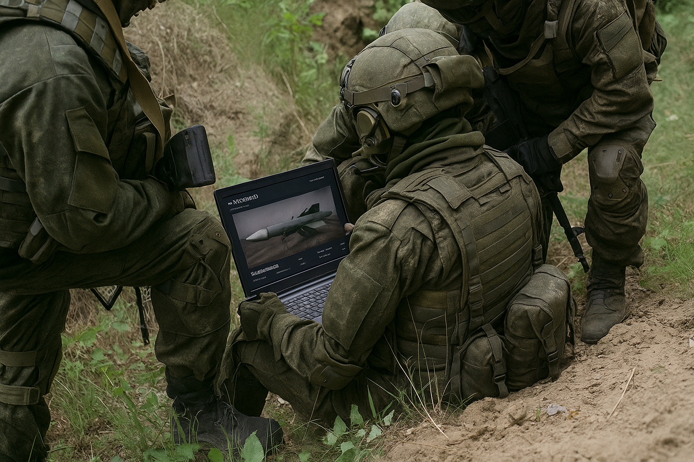

# 🔍 WeaponID – AI-Powered Weapon Recognition Platform




**WeaponID** is an AI-powered platform that enables the identification of weapons through image analysis and delivers detailed metadata about their origin, usage, and deployment. It is built for conflict researchers, journalists, OSINT analysts, and policy professionals to foster transparency in conflict zones and global arms circulation.

---

## 📦 Features

### 1. 🖼️ Image Upload & Prediction

- Upload weapon images via drag-and-drop or file input.
- Integrated machine learning model (YOLOv5, MobileNet, or Roboflow).
- Returns:
  - Weapon Name
  - Confidence Score

### 2. 🧠 Weapon Intelligence Panel

Displays in-depth metadata:
- Weapon Name
- Confidence Score
- Origin Country
- Type (e.g., Assault Rifle, Rocket Launcher)
- Manufacturer
- Production Years
- How It Works (Technical Summary)
- Conflict Zones Used
- Last Known Use (Location + Date)
- Export History
- External Links (Wikipedia, SIPRI, CAR)

### 3. 🔎 Search & Browse

- Search by weapon name.
- Filter by:
  - Weapon Type
  - Country of Origin
  - Conflict Zones
- Browse cards with preview metadata.
- Expand weapon profiles for full intelligence view.

### 4. 🗂️ User History *(Optional)*
- Save past scan results.
- Add personal notes and tags.
- Access all history from a user dashboard.

---

## 🧰 Technology Stack

### Frontend
- **Framework:** [Next.js](https://nextjs.org/)
- **Styling:** [Tailwind CSS](https://tailwindcss.com/)
- **File Upload:** `react-dropzone`
- **Charts:** `Recharts`, `Chart.js`
- **Maps:** [Mapbox](https://www.mapbox.com/)

### Backend
- **API Layer:** Next.js API Routes or Python (Flask / FastAPI)
- **Database:** PostgreSQL or MongoDB
- **ML Models:** YOLOv5, MobileNet, or Roboflow Datasets

### Deployment
- **Frontend:** [Vercel](https://vercel.com/)
- **ML Inference:** [Render](https://render.com/), [HuggingFace Spaces](https://huggingface.co/spaces), or AWS Lambda

---

## 🧭 User Flow

1. User uploads a weapon image.
2. Backend ML model runs prediction.
3. Confidence score + metadata is returned.
4. Weapon Intelligence Panel shows detailed information.
5. (Optional) User logs in to save and tag the search.
6. Search & Browse lets users explore other known weapons.


## 🔮 Future Enhancements

- 📹 **Video frame capture** and object detection.
- 🔁 **Feedback loop** to refine ML model accuracy over time.
- 👥 **Community-driven tagging** and metadata validation.
- 🧑‍💼 **Admin dashboard** for managing and curating weapon data.

---

## 🗃 Data Sources

- [SIPRI Arms Transfers Database](https://sipri.org)
- [Conflict Armament Research (CAR)](https://www.conflictarm.com/)
- [Wikipedia](https://www.wikipedia.org/)
- [Roboflow Weapon Datasets](https://roboflow.com/)

---

## 🎯 Why WeaponID Matters

> *"WeaponID helps remove the fog of war by transforming raw imagery into structured, actionable intelligence."*



In an era marked by rapid arms proliferation and misinformation, **WeaponID** empowers conflict analysts, journalists, and humanitarian workers with:
- Fast and explainable AI-assisted identification
- Verifiable metadata and historical usage
- Geospatial and contextual intelligence

It’s more than a tool — it's a bridge between visual evidence and actionable understanding.

---

## 🧪 Getting Started (Development Setup)

To run the project locally, follow these steps:

```bash
# Install dependencies
npm install

# Start development server
npm run dev
# or use
yarn dev
# or
pnpm dev
# or
bun dev

http://localhost:3000
```

✅ Let me know if you want me to regenerate the **entire README again** in one clean `.md` file or help you push it directly to GitHub.
